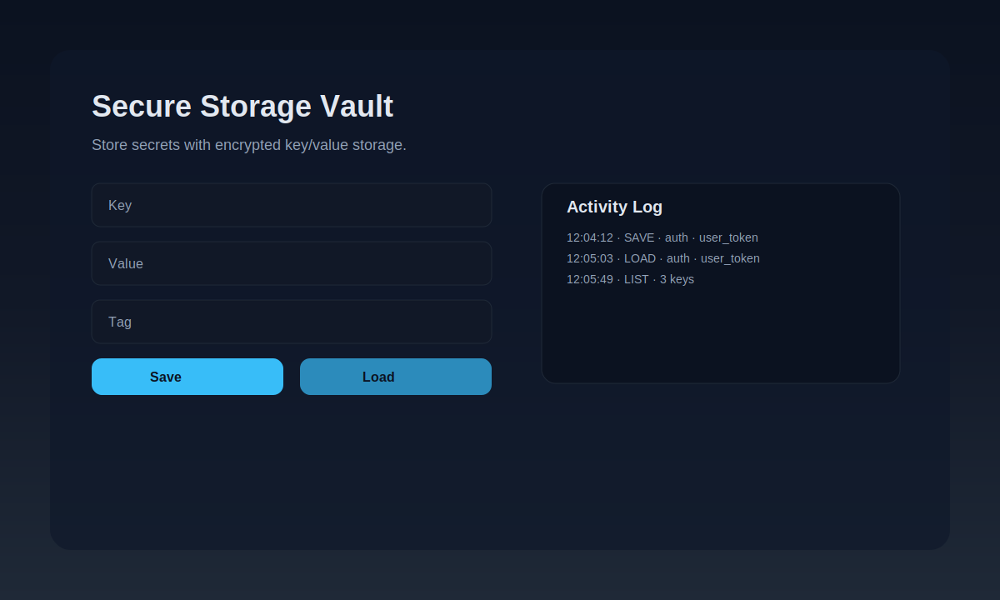
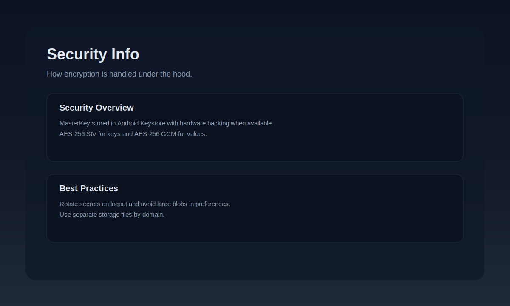
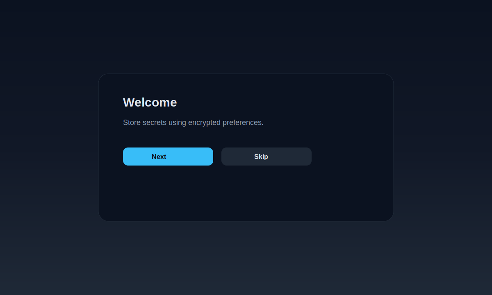

# android-secure-storage-kt

A modern Kotlin wrapper around `EncryptedSharedPreferences`, bundled with a polished Compose demo app.


## What you get
- A lightweight `secure-storage` library with a clean API
- A demo app that showcases encryption, tags, and action history
- Instrumented + unit tests
- CI workflow ready for GitHub Actions

## Screenshots




## Modules
- `secure-storage` : Encrypted key/value storage API
- `app` : Compose demo with onboarding + activity log

## Requirements
- `minSdk 23`
- Java 11 (current project configuration)
- AndroidX Security Crypto

## Quick start (library)
```kotlin
val storage = SecureStorageFactory.create(context)

storage.putString("token", "abc123")
val token = storage.getString("token")

storage.putBoolean("is_pro", true)
val isPro = storage.getBoolean("is_pro")

storage.putBytes("avatar", byteArrayOf(1, 2, 3))
val avatar = storage.getBytes("avatar")
```

## Demo app features
- Save, load, delete, and list keys
- Tags for organizing secrets
- Activity log (recent actions)
- Security info screen
- 3-step onboarding overlay

## How to run the app
1. Open the project in Android Studio.
2. Sync Gradle.
3. Start an emulator or connect a device.
4. Run the `app` configuration.

## Security model (summary)
- MasterKey stored in Android Keystore
- Keys encrypted with AES-256 SIV
- Values encrypted with AES-256 GCM

## API surface
```kotlin
interface SecureStorage {
    fun putString(key: String, value: String?)
    fun getString(key: String, defaultValue: String? = null): String?

    fun putBoolean(key: String, value: Boolean)
    fun getBoolean(key: String, defaultValue: Boolean = false): Boolean

    fun putInt(key: String, value: Int)
    fun getInt(key: String, defaultValue: Int = 0): Int

    fun putLong(key: String, value: Long)
    fun getLong(key: String, defaultValue: Long = 0L): Long

    fun putFloat(key: String, value: Float)
    fun getFloat(key: String, defaultValue: Float = 0f): Float

    fun putBytes(key: String, value: ByteArray?)
    fun getBytes(key: String): ByteArray?

    fun remove(key: String)
    fun clear()
    fun contains(key: String): Boolean
    fun allKeys(): Set<String>
}
```

## Configuration
```kotlin
val storage = SecureStorageFactory.create(
    context = context,
    config = SecureStorageConfig(
        fileName = "secure_storage",
        keyAlias = MasterKey.DEFAULT_MASTER_KEY_ALIAS
    )
)
```

## Testing
- Unit tests: `./gradlew :secure-storage:test`
- Instrumented tests: `./gradlew :secure-storage:connectedAndroidTest`

## CI
The workflow at `.github/workflows/android.yml` runs unit tests and assembles the demo app on each push and PR.

## Troubleshooting
- If Gradle complains about Java version, ensure Gradle JDK is set to Java 11.
- If the emulator is slow, use a smaller AVD (API 32) or switch graphics to Software.
- If resource linking fails, re-sync and clean the project.

## Roadmap
- Persist onboarding completion state
- Improve theming with Material3 (latest)
- Add publishing to Maven Central

## Release process
1. Update version info if needed.
2. Tag the commit.
3. Push the tag to GitHub.

